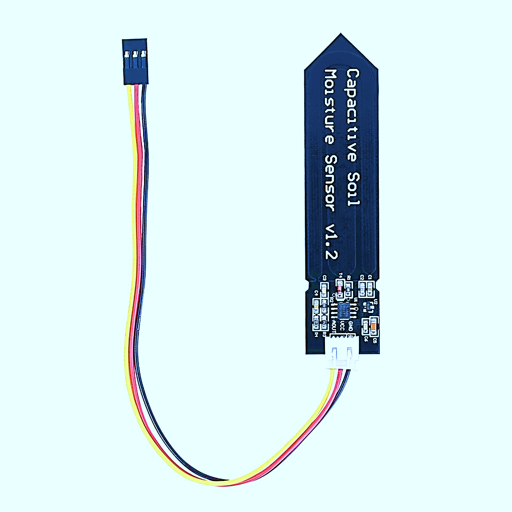
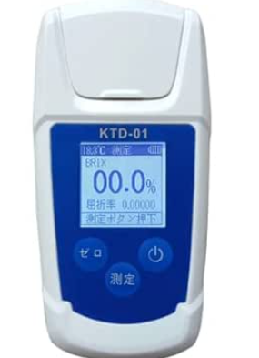

# 🍅 トマト栽培モニター (Tomato Sensor System)

> 学籍番号 18124058 河村隼介 / 前期取り組み

**このプロジェクトは、トマトの「糖度」と「収穫量」を高めることを目標に、栽培データを自動で集めて可視化し、最終的に機械学習で最適な育て方を見つけ出すシステムです。**

前期は「測る・ためる・見せる」仕組み(ESP32 + FastAPI + React)を一通り作りました。後期は、ためたデータを機械学習にかけて、糖度と収穫量を高める条件を分析・予測します。

---

## 目標 (何のために作るのか)

**ゴールは、糖度と収穫量の高いトマトを育てるための条件をデータから見つけること。**

トマトでは「水を絞る(水ストレス)と糖度は上がるが、収穫量や実のサイズは下がる」という相反する関係が知られています。つまり糖度と収穫量は単純には両立しません。だからこそ、土壌水分・天気・水やり・施肥などの複数のデータを多角的に機械学習にかけ、両方のバランスが良い育て方を探すことに意味があります。

そのために、まずは栽培データを正確に・継続的にためられる基盤を作りました。それがこのシステムです。

---

## 何をするシステムか

大きく3つの役割があります。

- **測る**: ESP32 マイコン + 静電容量式土壌水分センサー3本で、土壌水分を計測する。
- **ためる**: 計測値・天気・水やり・収穫・糖度などをサーバーのデータベースに一元管理する。
- **見せる**: ブラウザのダッシュボードでグラフ・数値として可視化する。

後期はここに「**学ぶ(機械学習で予測・分析する)**」を追加します。

### 測定方法 (重要な設計変更)

当初は「1株に1本のセンサーを挿しっぱなしで15分毎に連続記録」していましたが、精度を上げるため **「1つの株を3本のセンサーで測り、その平均をその株の代表値とする」** 方式に変更しました。1日に数回、画面で株を選んで記録します。元の3本の値も残すので、後から見直せます。以前の連続ログは参考データとして残しています。

### 取得・記録できるデータ (現状)

| 区分 | データ | 取得方法 |
|---|---|---|
| 土壌水分 | 株ごとの3本平均 + 元の3本の値 | センサー (記録時) |
| 土壌水分 | 連続ログ (参考) | センサー (自動) |
| 環境 | 天候・気温・湿度・日照時間 | Open-Meteo API (自動) |
| 環境 | 開花からの累積日照時間 | 自動計算 |
| 株 | 品種・植えた日・最終草丈 | 手入力 |
| 水やり | 日時・量 (ml) | 手入力 |
| 収穫 | 日・個数・**糖度 (brix)** | 手入力 |
| 実 | 開花日・収穫日・高さ・直径・重量・糖度 | 手入力 |
| 記録 | 写真 | アップロード |

> **予測したい目標(糖度・収穫量)の「正解データ」はすでに取れています。** 後は、それを説明する入力データ(EC・施肥記録・管理作業など)をどれだけ増やせるかが精度の鍵になります。

---

## 機械学習の計画 (後期)

**目標は、糖度・収穫量を高める条件を予測・分析すること。**

- **予測対象 (出力)**: 糖度 (brix)、収穫量 (個数・重量)。あわせて「翌日の土壌水分」も予測し、水やり判断に使う。
- **入力データ (特徴量)**: 土壌水分の平均値、気温・湿度・日照、前回の水やりからの経過時間、施肥、累積日照など。前日の値を持たせる「ラグ特徴量」を作る。
- **手法**: まずは説明しやすい回帰モデル(線形回帰・決定木・ランダムフォレスト)から。データが増えたら勾配ブースティング (LightGBM) や時系列向けの LSTM も検討。
- **ライブラリ**: Python の scikit-learn / pandas。
- **評価**: データを時間の前後で分割(過去で学習し未来を当てる)。指標は MAE / RMSE。
- **当面の課題**: 機械学習には十分なデータ量が必要。まずは1日数回の測定を継続してデータをためる。

### 追加で取るとよいデータ (糖度・収穫量に効く順)

1. **EC (土壌の電気伝導度)** — 糖度と直結。センサー追加の価値が大きい。
2. **施肥の記録** (種類・量・日付) — 手入力で済み、収穫量・糖度の両方に効く。
3. **管理作業の記録** (摘芽・摘果・摘心・着果数・花房数) — 収穫量や実のサイズに直接効く。
4. **現地の気温・湿度** (DHT22 等) — 天気APIの地域値より正確。特に昼夜の温度差(日較差)は糖の蓄積に効く。
5. **照度センサー** — 実際に株に当たる光量。地温・pH も余裕があれば。

---

## 技術スタック

| 層 | 技術 |
|---|---|
| **マイコン** | ESP32 (Freenove ESP32 WROOM) + Arduino (C++) |
| **センサー** | 静電容量式土壌水分センサー × 3 (GPIO34/35/32) + 1kΩ 保護抵抗 |
| **バックエンド** | Python + FastAPI + SQLAlchemy 2.0 + Pydantic 2 |
| **データベース** | PostgreSQL 16 |
| **フロントエンド** | React 18 + Vite + Chart.js + react-chartjs-2 |
| **インフラ** | Docker Compose |
| **外部 API** | Open-Meteo (天気・気温・湿度・日照時間) |
| **機械学習 (後期)** | Python + scikit-learn + pandas |
| **バージョン管理** | Git / GitHub |

---

## 主な部品

<p>
  
  
  
</p>

左から、ESP32(マイコン)、静電容量式土壌水分センサー、糖度計 (KTD-01)。

> ※ 上記は使用部品の参考写真です。実機の配線・運用中・ダッシュボードの写真は今後 `docs/images/` に追加予定。

---

## システム構成 (データの流れ)

```
        ┌─────────────────┐
        │     ESP32       │  WiFi 経由で
        │ + 土壌水分3本   │  POST /api/measurements (JSON)
        └────────┬────────┘
                 │ HTTP
                 ▼
┌──────────────┐    ┌─────────────────┐    ┌──────────────┐
│ Open-Meteo   │───▶│   FastAPI       │◀───│ React (Vite) │
│ (天気API)    │    │ + PostgreSQL    │    │ Dashboard    │
└──────────────┘    │   (Docker)      │    └──────────────┘
       ▲            └─────────────────┘
       │
 Python script (定時実行)
```

機器も画面も天気も、すべて **REST API + JSON** という共通の方法でやり取りしているため、後から部品(センサーや機能)を足しやすい作りになっています。

---

## 主な機能

- **測定の記録パネル** (React): 株を選ぶ → 今の3本の値と平均を確認 → 「記録」で保存 → その株の平均%推移グラフと履歴表を表示。
- **ダッシュボード**: 各センサーの最新値(色分け)、期間別グラフ(24h / 7日 / 30日)、環境データ(現在＋履歴)、株/実の登録・編集・削除、水やり/収穫の履歴、画像ギャラリー。
- **計算ロジック**: 開花からの累積日照時間を環境データと開花日から自動算出。
- **省電力**: ESP32 のディープスリープ。電池駆動。

---

## セットアップ

### 必要なもの

- Docker Desktop / Node.js 20+ / Python 3.10+ / Arduino IDE 2.x (ESP32 開発時のみ)

### バックエンド + DB

```bash
git clone https://github.com/<yourname>/tomato-sensor.git
cd tomato-sensor
docker compose up -d --build
```

- API ドキュメント (Swagger): http://localhost:8001/docs
- ヘルスチェック: http://localhost:8001/healthz

### フロントエンド

```bash
cd frontend
npm install
npm run dev
```

ブラウザで http://localhost:5173/ (または 5174) を開く。

### ESP32 ファームウェア

1. Arduino IDE で `firmware/tomato_sensor_esp32/tomato_sensor_esp32.ino` を開く
2. ボード: **ESP32 Dev Module**
3. ライブラリ: **ArduinoJson** をインストール
4. `config.h` に WiFi 情報・SERVER_URL (PC の LAN IP)・校正値を記入
5. 校正値 (`DRY_VALUES` / `WET_VALUES`) は **実際に使う土で測定** して書き込む
6. Upload (→ボタン) で書き込み

### 配線 (ESP32)

| センサー | VCC | GND | AOUT |
|---|---|---|---|
| Sensor 0 | 3V3 | GND | GPIO 34 (← 1kΩ) |
| Sensor 1 | 3V3 | GND | GPIO 33 (← 1kΩ) |
| Sensor 2 | 3V3 | GND | GPIO 32 (← 1kΩ) |

> **AOUT と GPIO の間に 1kΩ の保護抵抗を直列に入れる。** センサー故障時にマイコンの ADC が壊れるのを防ぐため (実際に1度壊した教訓)。
> ADC2 系のピンは WiFi と競合するので NG。GPIO 34/33/32 は ADC1 系。(旧 GPIO35 が破損したため Sensor 1 を GPIO33 に変更)

### 外部 API スクリプト

```bash
python scripts/fetch_weather.py
python scripts/fetch_weather.py --lat 35.68 --lon 139.69   # 緯度経度指定
```

Windows タスクスケジューラに登録すれば定時自動取得可能。

---

## ディレクトリ構成

```
tomato-sensor/
├── backend/                 # FastAPI バックエンド
│   ├── app/
│   │   ├── main.py          # アプリエントリ (CORS + lifespan)
│   │   ├── config.py        # 環境変数
│   │   ├── database.py      # SQLAlchemy 設定
│   │   ├── models.py        # ORM (8 テーブル)
│   │   ├── schemas.py       # Pydantic 入出力
│   │   ├── crud.py          # DB アクセス
│   │   └── routers/         # 各リソースのエンドポイント
│   │       ├── readings.py       # 土壌水分 (連続ログ)
│   │       ├── measurements.py    # 測定 (1株を3本で測った平均)
│   │       ├── environments.py
│   │       ├── plants.py
│   │       ├── waterings.py
│   │       ├── harvests.py
│   │       ├── fruits.py
│   │       └── images.py
│   ├── data/images/         # 画像保存ディレクトリ (volume)
│   ├── Dockerfile
│   └── requirements.txt
├── frontend/                # React + Vite フロント
│   ├── src/
│   │   ├── App.jsx
│   │   ├── components/
│   │   │   ├── SummaryCards.jsx       # 現在のセンサー値 (記録前の確認)
│   │   │   ├── MeasurementPanel.jsx    # 測定の記録 + 株ごとの履歴
│   │   │   ├── MeasurementChart.jsx    # 平均%の推移グラフ
│   │   │   ├── EnvironmentPanel.jsx
│   │   │   ├── MoistureChart.jsx       # 連続ログ (参考)
│   │   │   ├── PlantManager.jsx
│   │   │   ├── FruitManager.jsx
│   │   │   └── ImageGallery.jsx
│   │   └── hooks/           # データ取得フック群 (useMeasurements 等)
│   └── vite.config.js       # /api と /static を backend にプロキシ
├── firmware/                # ESP32 スケッチ
│   └── tomato_sensor_esp32/
│       ├── tomato_sensor_esp32.ino
│       └── config.h          # WiFi 情報・校正値 (gitignore)
├── scripts/
│   ├── fetch_weather.py      # Open-Meteo 取得スクリプト
│   └── fetch_weather.bat     # タスクスケジューラ用ラッパー
├── docs/
│   └── presentation_script.md  # 発表原稿
├── docker-compose.yml        # db (postgres) + backend (fastapi)
└── README.md
```

---

## API エンドポイント概要

| メソッド | パス | 用途 |
|---|---|---|
| GET / POST / DELETE | `/api/readings` | 土壌水分の連続ログ (ESP32 が POST) |
| GET / POST / DELETE | `/api/measurements` | 測定 (1株を3本で測り平均を保存) |
| GET / POST / DELETE | `/api/environments` | 天候・気温・湿度・日照 |
| GET / POST / PATCH / DELETE | `/api/plants` | 株 |
| GET / POST / DELETE | `/api/waterings` | 水やり |
| GET / POST / DELETE | `/api/harvests` | 収穫 |
| GET / POST / PATCH / DELETE | `/api/fruits` | 実 |
| GET | `/api/fruits/{id}/sunlight-since-flowering` | 累積日照時間 |
| GET / POST / DELETE | `/api/images` | 画像 (multipart) |

詳細は `/docs` (Swagger UI) 参照。

---

## つまずいた点 / 学んだこと

- **センサー水没による故障**: 校正時に基板まで水に浸けてショート。校正は濡れた土で行い、基板は水に浸けない。
- **保護抵抗なしによる ADC 破損**: 故障したセンサーが AOUT を GND に短絡し、ESP32 の ADC ピンを壊した。→ AOUT と GPIO の間に **1kΩ の保護抵抗**を直列に入れて解決。
- **CORS + Vite プロキシ**: フロントからバックを直接 fetch せず、Vite プロキシで `/api` を中継して CORS を回避。
- **Windows ファイアウォール + ネットワークプロファイル**: 「Public」だと LAN 内通信もブロック → 「Private」に変更で解決。
- **pydantic-settings のリスト自動パース**: `cors_origins` は `str` で受けて property で split する。
- **校正の考え方**: 同じ raw でもセンサーごとに % が違うのは校正差。センサー同士を横並び比較せず、各センサーの時間変化で見る。平均を取るなら校正を揃える。

---

## ライセンス

学習目的のプロジェクト。
